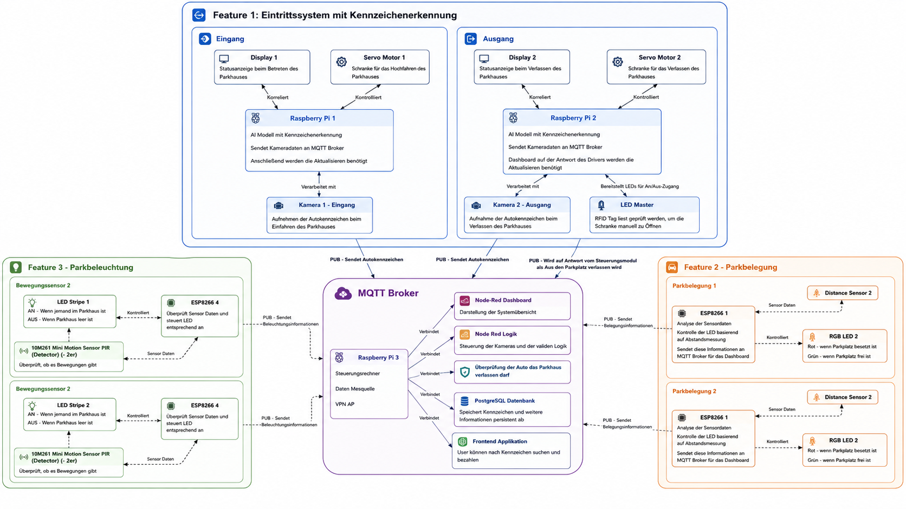

# Cyber-Physical Systems (SoSe 2026) – Smart Parking

Course repository for *Cyber-Physical Systems* at OTH Regensburg: weekly IoT modules (Arduino, ESP8266, MQTT, Node-RED) and a team project – a **smart parking system** with license plate recognition, occupancy detection and automated barrier control.

## My part: License Plate Recognition (`studienarbeit/Nummernschilderkennung`)

Real-time license plate recognition on a Raspberry Pi at the parking entrance and exit.

- **Detection:** YOLOv8n, exported to NCNN for fast inference on the Pi
- **OCR:** EasyOCR + regex validation for German plates, temporal voting over several frames to stabilise the result
- **Integration:** publishes plates via MQTT → Node-RED backend → barrier motor and display control
- **Live stream:** Flask MJPEG stream for monitoring

Tech: Python · OpenCV · Ultralytics YOLO · EasyOCR · MQTT · Node-RED · Raspberry Pi

## Repository structure

| Folder | Content |
|---|---|
| `module*` | weekly course modules (IoT basics, MQTT, Node-RED, …) |
| `studienarbeit/` | team project: plate recognition, parking occupancy, backend, RFID, lights, reports |
| `Smart_Parking/` | dashboards and parking project files |
| `submissions/`, `reflections/` | course submissions |
